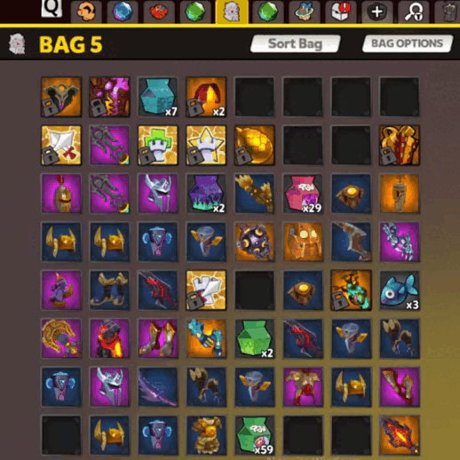

# AutoHotkey Scripts

A collection of small AutoHotkey scripts that automate repetitive tasks in games.

| Script | Description |
|---|---|
| [DD2 Inventory Cleaner](DD2_Inventory_Cleanup) | Speeds up inventory cleanup in Dungeon Defenders 2 |
| [HotkeyLooper](HotkeyLooper) | Presses a key at a set interval (anti-AFK, game automation) |

## Requirements

- Windows
- [AutoHotkey](https://www.autohotkey.com/)

## Getting started

1. Install AutoHotkey.
2. Clone or download this repository:

   ```bash
   git clone https://github.com/jirimdf/autohotkey-scripts.git
   ```

3. Run the script you want by double-clicking its `.ahk` file.

---

## DD2 Inventory Cleaner

`DD2_Inventory_Cleanup/LupusClear.ahk`

After pressing **End**, the script moves the mouse cursor slot by slot across the Dungeon Defenders 2 inventory grid (7 columns × 8 rows) with a short pause on each slot. While the cursor is over an item, press **S** to sell it.



**Usage**

1. Run `LupusClear.ahk`.
2. Open your inventory in the game and press **End**.
3. Press **S** to sell the highlighted items.

The grid size, the spacing between slots and the delay can be changed in the script. You may need to adjust them to match your screen resolution.

---

## HotkeyLooper

A simple GUI utility that automatically presses a key at a regular interval. There are two versions:

**`HotkeyLooper/LupusLooper.ahk` (v1)**

- GUI with **Start** and **Stop** buttons
- After clicking **Start**, the script presses **G** every 5 seconds
- Stop it with the **Stop** button or the **Esc** key

**`HotkeyLooper/LupusLooperV2.ahk` (v2)**

- GUI with **Start**, **Pause**, **Stop** and close buttons
- The **End** key toggles the loop on and off
- In each cycle the script switches windows with **Alt+Tab** and presses **G**, every 5 seconds, so it can keep two windows active at the same time

The key and the interval can be changed in the script.

---

## Disclaimer

Using automation scripts may be against the rules of some games. Use them at your own risk.

## License

This project is licensed under the [MIT License](LICENSE).
